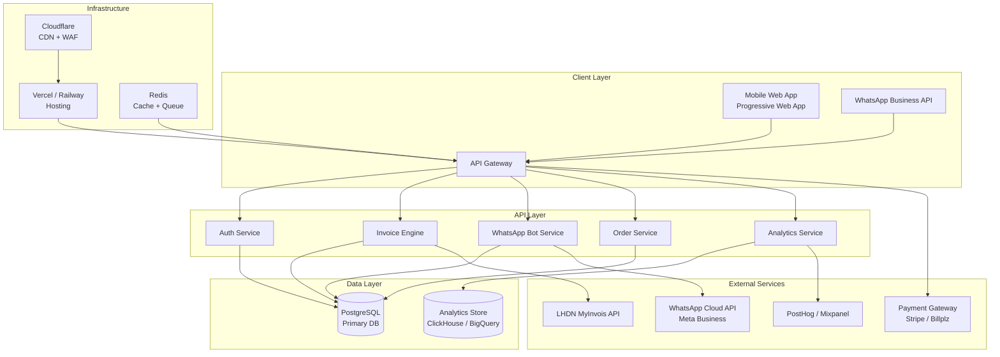
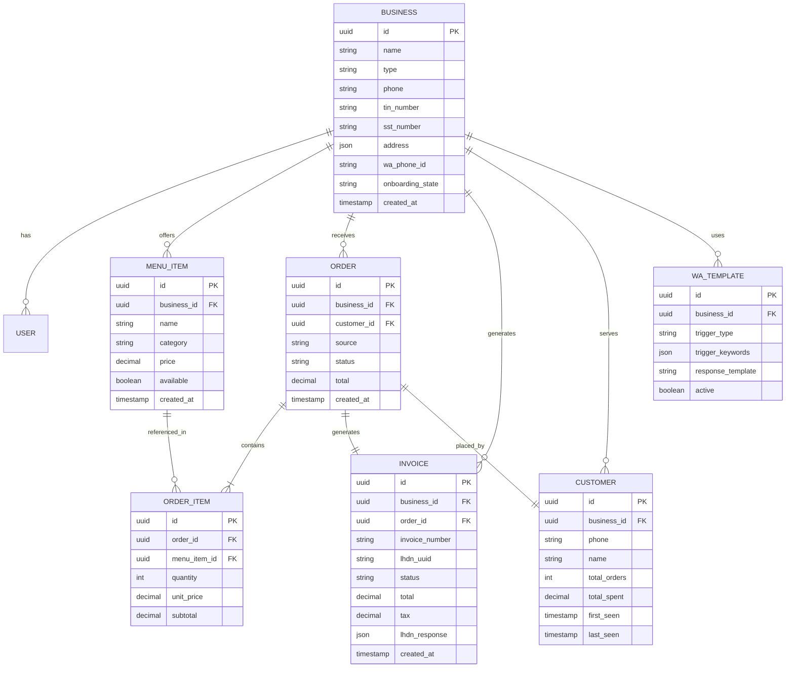

# System Architecture — Tapau GTM Platform

## Architecture Overview



---

## Core Components

### 1. Invoice Engine

| Aspect | Specification |
|---|---|
| **Purpose** | Generate, store, and submit LHDN-compliant e-invoices |
| **LHDN API** | MyInvois API v1.0 (REST) |
| **Invoice Format** | JSON (internal) → XML UBL 2.1 (LHDN submission) |
| **Signing** | Digital signature via LHDN-issued certificate |
| **Storage** | PostgreSQL + S3 (PDF copies) |
| **Key Operations** | Create, void, query status, bulk generate |

#### Invoice Flow
```
Order Confirmed → Invoice Created (draft)
    → Tax Calculated (SST rules engine)
    → LHDN Submission (async, retry on failure)
    → UUID Received → Invoice Finalized
    → PDF Generated → Sent to Customer (WhatsApp/Email)
```

#### LHDN Integration Requirements
| Requirement | Detail |
|---|---|
| TIN validation | Validate seller/buyer TIN against LHDN |
| MSIC codes | Map business types to correct codes |
| Mandatory fields | 50+ fields per LHDN spec |
| Submission | Real-time API call per invoice |
| QR code | Embed LHDN validation QR on each invoice |
| Retry logic | Queue failed submissions, retry with exponential backoff |

---

### 2. WhatsApp Integration Layer

| Aspect | Specification |
|---|---|
| **API** | WhatsApp Cloud API (Meta Business Platform) |
| **Connection** | Phone number registration via Meta Business Manager |
| **Message Types** | Text, template, interactive (buttons, lists) |
| **Webhook** | Receive incoming messages via webhook endpoint |
| **Rate Limits** | Tier-based: 250 → 1K → 10K → 100K messages/day |

#### Architecture
```
Customer WhatsApp Message
    → Meta Webhook → API Gateway
    → WhatsApp Bot Service
        → Intent Parser (keyword matching + NLP)
        → Template Matcher
        → Response Generator
    → Send Reply via Cloud API
    → Log Interaction → Analytics
```

#### Abstraction Layer (Platform Independence)
```
MessagingProvider Interface
├── WhatsAppProvider (primary)
├── SMSProvider (fallback)
├── EmailProvider (fallback)
└── WebChatProvider (future)
```

> Design for WhatsApp dependency risk: abstract the messaging layer so channel switching is configuration, not code change.

---

### 3. CRM / Order Tracking

| Aspect | Specification |
|---|---|
| **Purpose** | Track customers, orders, and lifetime value |
| **Customer Identity** | Phone number (primary key for F&B SMEs) |
| **Auto-Profile** | Build profiles automatically from WhatsApp interactions |
| **Order Sources** | WhatsApp, dashboard manual entry, future POS integration |

#### Data Model



---

## Technology Recommendations

| Layer | Technology | Rationale |
|---|---|---|
| **Frontend** | Next.js (PWA) | Mobile-first, offline capable, SEO for landing pages |
| **Backend** | Node.js + Express / Fastify | JavaScript ecosystem, fast development |
| **Database** | PostgreSQL + Prisma ORM | Relational data, strong typing, migrations |
| **Cache** | Redis | Session management, rate limiting, job queues |
| **Queue** | BullMQ (Redis-backed) | Async invoice submission, WhatsApp message processing |
| **Analytics** | PostHog (self-hosted) or Mixpanel | Event tracking, funnels, retention dashboards |
| **Hosting** | Railway or Vercel + Supabase | Easy deployment, autoscaling, managed Postgres |
| **CDN** | Cloudflare | Performance, security, DDoS protection |
| **Storage** | Cloudflare R2 or S3 | Invoice PDFs, menu images |
| **Auth** | Supabase Auth or Clerk | Phone/email login, simple for SMEs |
| **Payments** | Billplz or Stripe MY | FPX support, local payment methods |

---

## Deployment Architecture

```
Production
├── Vercel (Frontend + API routes)
│   ├── Next.js app
│   └── API endpoints
├── Railway (Backend services)
│   ├── WhatsApp webhook worker
│   ├── Invoice submission worker
│   └── Analytics ingestion
├── Supabase (Database)
│   ├── PostgreSQL
│   └── Auth
├── Redis (Upstash)
│   ├── Rate limiting
│   └── Job queues
└── External APIs
    ├── LHDN MyInvois
    ├── WhatsApp Cloud API
    └── Billplz
```

---

## Dependency Map

| Dependency | Risk Level | Mitigation |
|---|---|---|
| **LHDN MyInvois API** | Medium | Queue + retry, store locally first |
| **WhatsApp Cloud API** | High | Abstraction layer, SMS/email fallback |
| **Meta Business Manager** | High | Multi-number registration, compliance team |
| **Payment Gateway** | Low | Multiple provider support |
| **Hosting (Vercel/Railway)** | Low | Standard SaaS infrastructure |
| **PostgreSQL** | Low | Managed service with automated backups |
